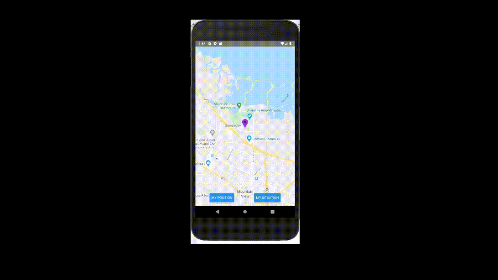

## Installation

To use this mobile environment you need to install (`YARN INSTALL`) all dependencies described on package.json, and create a .env file with the URL of the current backend and your GOOGLE API KEY. For mobile you must use adbreverse url with the actual IP address from ifconfig terminal command.

## Running on Android

Install Android Studio program and generate a android device emulation. Run `YARN START` to generate all relay graphql __generated__ files and `YARN RUN ANDROID` to open and update android device emulation with actual version app.

## Examples

#### Not tracking (dismiss dialog)

#### Tracking Example (Situation selection)

#### Situation change (relay's useMutation)

#### Move Camera to You

